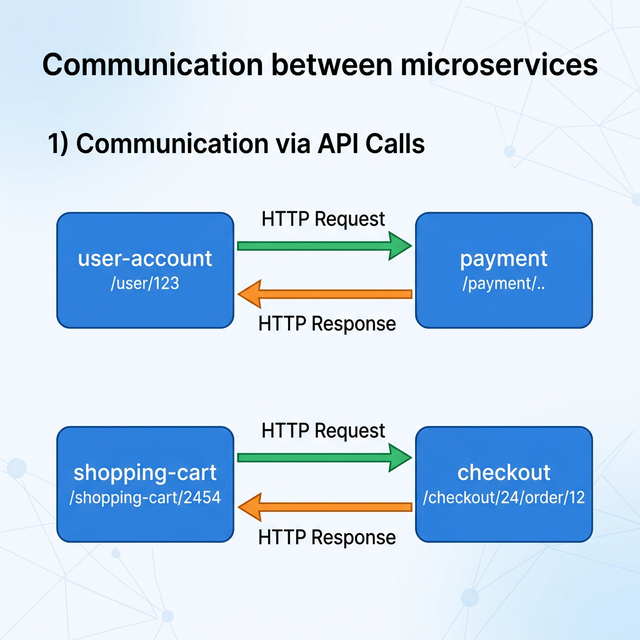
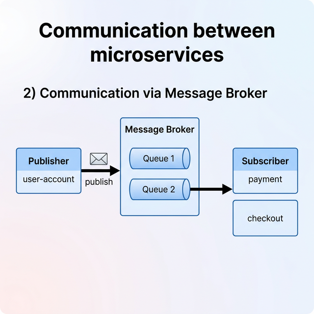
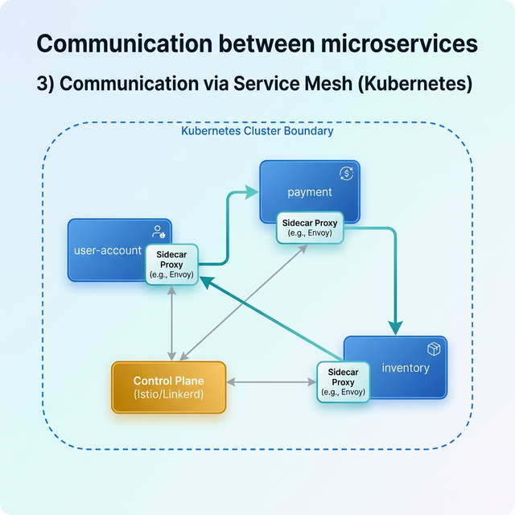

# Microservice Communication

This project demonstrates the three primary ways microservices communicate with each other.

## 1. Communication via API Calls

Microservices can talk to each other by sending HTTP requests to respective API endpoints. Each service maintains its own API.

### Key Features

- **Independent Services**: Each service does one thing well (User Account, Payment, Shopping Cart, Checkout).
- **RESTful Communication**: Services interact via standard HTTP Request/Response cycles.
- **Scalability**: Scaling services independently based on load.

---

## 2. Communication via Message Broker

Microservices can also communicate asynchronously using a Message Broker (like RabbitMQ or Kafka). This follows the Publish/Subscribe pattern.

### Key Features

- **Asynchronous Communication**: The publisher doesn't wait for a response, improving system responsiveness.
- **Decoupling**: Services don't need to know about each other; they only interact with the broker.
- **Reliability**: Messages are queued and can be processed when the subscriber is ready.

---

## 3. Communication via Service Mesh (Kubernetes)

When using Kubernetes, a Service Mesh (like Istio or Linkerd) provides a dedicated infrastructure layer for service-to-service communication.

### Key Features

- **Sidecar Proxies**: Each service has a sidecar proxy (e.g., Envoy) that handles all network traffic.
- **Traffic Management**: Fine-grained control over routing, retries, and circuit breaking.
- **Observability & Security**: Built-in monitoring, logging, and mutual TLS (mTLS) for secure communication.
